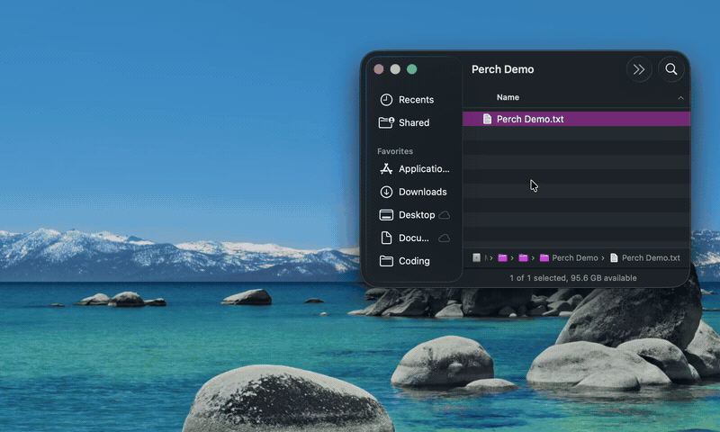

<p align="center">
  
</p>

<h1 align="center">Perch</h1>

<p align="center">
  A free, open-source drag-and-drop <b>shelf</b> for macOS —<br>
  a Yoink / Dropover-style staging area that lives on your screen edges.
</p>

<p align="center">
  <a href="LICENSE"></a>
  
  <a href="https://github.com/maxthegray/Perch/releases"></a>
</p>

Drag anything onto a screen-edge tab, Perch holds it, and you drag it back out later —
into any app. File promises work in **both** directions, so sources and destinations that
only speak promises (Photos, Mail, Messages) keep working, and the source app doesn't have
to still be running when you drop.

<!-- TODO: add a demo GIF here — e.g.  -->

## Install

### Homebrew (recommended)

```sh
brew tap maxthegray/tap
brew trust --cask maxthegray/tap/perch
brew install --cask perch
xattr -dr com.apple.quarantine /Applications/Perch.app
```

> Perch is ad-hoc signed, not notarized, so macOS Gatekeeper blocks the first launch.
> The `xattr` line clears the quarantine flag; alternatively, right-click `Perch.app`
> in `/Applications` and choose **Open** once. (`brew trust` is required because
> Homebrew 6+ won't load casks from third-party taps until you trust them.)

### Manual download

Grab `Perch.zip` from the [latest release](https://github.com/maxthegray/Perch/releases),
unzip it, move `Perch.app` to `/Applications`, then right-click it and choose **Open**.

### Build from source

```sh
swift Scripts/make-icon.swift   # one-time: generates the app icon
./Scripts/build-app.sh          # builds + ad-hoc-signs Perch.app
mv Perch.app /Applications && open /Applications/Perch.app
```

Perch runs as an **accessory** app — no Dock icon, no menu-bar item. Requires macOS 14+.

## Features

- **Stash anything** — files, text, images, URLs, even file promises from Photos/Mail/Messages.
- **Time-shifted drag & drop** — pick things up now, drop them somewhere else later; the source app can quit in between.
- **Quick Look thumbnails** — real previews of images, PDFs, and documents.
- **Two looks, toggled live** — refined **Glass** or ultra-minimal **Minimal**.
- **Grows to fit** — the card hugs its contents and expands as you add items.
- **Reorder & put back** — drag rows to rearrange; hover a row's **✕** to return the file to where it came from (right-click ▸ Delete to remove it for good).
- **Edge docks** — left, right, and the notch, each individually toggleable.
- **Stays out of the way** — no Dock/menu-bar clutter; optional launch-at-login; multi-monitor aware.
- **Local & private** — everything is plain files on disk. No network, no accounts, no tracking.

## Use it

- **Stash:** start dragging anything; a tab appears on the nearest screen edge (and on the
  notch). Drag over it and the shelf slides out — drop onto it to store.
- **Retrieve:** hover the edge to reveal the shelf, then drag an item out into any app.
  Items move out by default (the shelf hands off its copy).
- **Reorder:** drag a row up/down *within* the shelf to rearrange; drag it *out* to vend.
- **Right-click** an item or the shelf for **Quick Look**, **Delete**, **Clear All**,
  **Appearance ▸ Glass / Minimal**, **Edges ▸ Left / Right / Top**, **Launch at Login**,
  and **Quit**.
- **Hover** a row (Glass) to reveal a **✕** that moves the file back to its original location.

## Updating

```sh
brew upgrade --cask perch          # if installed via Homebrew
./Scripts/install.sh               # if built from source — rebuilds + reinstalls in place
```

## Data

Everything lives under `~/Library/Application Support/Perch/`:

```
index.json          # ordered item list (display order)
items/<uuid>/
  meta.json         # item metadata
  reps/rep-N.dat    # raw pasteboard representations
  files/            # copied real files + materialized promises
```

Plain JSON + files on disk — inspectable, and easy to delete.

## License

[MIT](LICENSE) © Maximilian Reich
