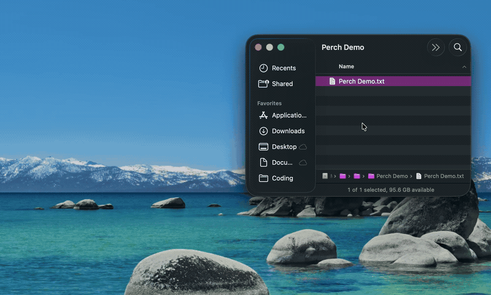

  

<h1 align="center">Perch</h1>

  A drag-and-drop shelf for macOS.

> This branch contains the experimental Smart Perch product track. Stable Perch lives
> on `main`; normal development for its next release lives on `beta`.

Perch gives you a small place to set things down while you work. Start dragging a file, image, link, or bit of text and the shelf appears at the edge of your screen. Drop it there, switch to another app, and drag it back out when you're ready.

It also understands file promises from apps like Photos, Mail, and Messages, so it works with the things that don't become ordinary files until you actually drop them somewhere.

  

## Install

1. Download `Perch.zip` from the [latest release](https://github.com/maxthegray/Perch/releases/latest).
2. Unzip it.
3. Drag `Perch.app` into your Applications folder.
4. Open Perch from Applications.

Perch requires macOS 14 or newer. It has no Dock or menu-bar icon; once launched, it quietly waits at the screen edge. You can enable Launch at Login from Settings.

## How it works

- **Put something aside.** Start dragging and Perch can open automatically at the nearest enabled edge. Drop onto the shelf to keep the item there.
- **Pick it up later.** Hover the edge to bring Perch back, then drag the item into Finder or another app. Dragging out can move the item off the shelf or leave a copy behind.
- **Bring the shelf to you.** Shake the pointer to summon Perch near the cursor. If you'd rather keep it somewhere specific, enable dragging, pull it away from the edge, and optionally lock it in place.
- **Catch recent files.** New files in Downloads or on the Desktop can appear as dimmed suggestions. Downloads that finish together collapse into a session you can expand, inspect, or add all at once.
- **Right-click for the useful stuff.** Quick Look, Delete, Return, History, Settings, and update checks are all close at hand.

## Make it yours

**General** keeps the few choices that change what happens to your files: launch at login, and whether dragging an item out moves it or leaves a copy.

**Advanced** splits three ways. *Look* has the Glass or Minimal style, whether items sit in a list or stack like a deck, the shelf's size, and the small stuff — names, shadow, edge tab. *Behavior* covers when the shelf shows up, how you move a floating one, and recent-download suggestions. *Docking* is which edges it can dock to and how it snaps to them; at least one edge always stays enabled.

Perch remembers these choices between launches and can check for updates through Sparkle.

## Your files stay yours

Items on the shelf are stored as ordinary files under `~/Library/Application Support/Perch/`. There are no accounts, analytics, or tracking. Perch only uses the network for automatic or manual update checks.

## Labs

There is a third settings pane that ships hidden, holding an experiment called **Smart Perch**: it reads screenshots you drop so it can name them from their contents, and it remembers which folder you usually file a kind of item in so it can offer to put the next one there for you.

It is off, and none of it runs until you turn it on — no database is created and no text recognition happens. Everything it learns is kept in a file on your Mac and never leaves it. If you want to look, click the version number in General five times.

## License

[MIT](LICENSE) © Maximilian Reich
